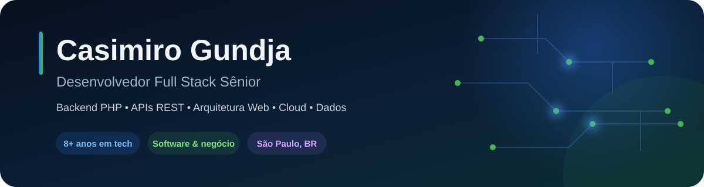

  

  
  
  
  

## Sobre mim

Sou **Desenvolvedor Full Stack**, com mais de **7 anos de experiência em tecnologia**. Atuo no desenvolvimento, evolução e sustentação de sistemas corporativos, plataformas web de alta criticidade e integrações distribuídas que apoiam operações centrais de negócio.

Minha experiência abrange o desenvolvimento de ponta a ponta: backend sólido com **C# (.NET Core / ASP.NET)**, **Node.js (NestJS / Express)** e **PHP**, arquitetura de **APIs RESTful**, modelagem e otimização de bancos de dados (**PostgreSQL, SQL Server, MySQL**), frontend moderno e responsivo com **React, TypeScript e Vue.js**, além de conteinerização com **Docker** e serviços em nuvem (**Azure**).

> Transformo desafios de negócio e fluxos corporativos complexos em soluções escaláveis, resilientes e orientadas a resultados.

## Onde gero impacto

<table>
  <tr>
    <td width="33%" valign="top">
      <strong>⚙️ Backend e integrações</strong>  
      APIs RESTful, microsserviços, automações de processos de negócio, mensageria e comunicação entre sistemas distribuídos.
    </td>
    <td width="33%" valign="top">
      <strong>🏗️ Arquitetura e qualidade</strong>  
      Clean Code, SOLID, modelagem relacional de dados, code review, boas práticas de engenharia e foco em estabilidade.
    </td>
    <td width="33%" valign="top">
      <strong>☁️ Operação e entrega</strong>  
      Containers Docker, Azure Cloud, esteiras de integração contínua (CI/CD) e interfaces dinâmicas com React e TypeScript.
    </td>
  </tr>
</table>

## Stack principal

  
  
  
  
  
  
  
  
  
  
  
  
  
  
  
  
  
  
  
  

## Experiência aplicada em diferentes negócios

Ao longo da carreira, desenvolvi e sustentei soluções estratégicas para **logística e comércio exterior (RACHI)**, **ecossistemas educacionais e acadêmicos (KLASSE, FAP e UNICAMP)**, **indústria 4.0 e automação fabril (Greenbrier Maxion)** e **soluções corporativas em TI (Grupo Assist, Braga Soluções e Promac)**. Esses contextos consolidaram minha experiência com:

- arquitetura e sustentação de sistemas de alta criticidade e disponibilidade;
- desenvolvimento de microsserviços e consumo/criação de APIs RESTful;
- modelagem estruturada de bancos de dados relacionais e otimização de consultas;
- colaboração técnica, revisão de código (Code Review) e práticas ágeis (Scrum/Kanban);
- automação de processos corporativos, conteinerização e esteiras CI/CD.

## Formação

🎓 **MBA em Engenharia de Software**  
Faculdade Metropolitana (2021 — 2022)

🎓 **Pós-Graduação em Ciência de Dados e Big Data Analytics**  
Faculdade Metropolitana (2020 — 2022)

🎓 **Bacharelado em Sistemas de Informação**  
Centro Universitário Adventista de São Paulo — UNASP (2016 — 2020)

---

  <strong>Construindo software confiável, escalável e conectado às necessidades reais do negócio.</strong>

